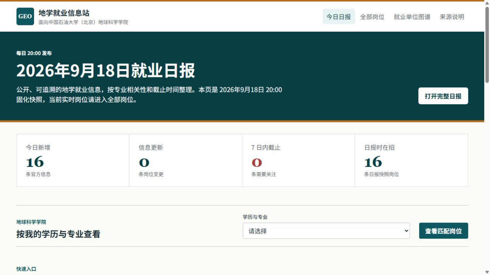

# Phase 1 质量报告

日期：2026-09-20
范围：仅本地代码、版本化来源/单位注册表和临时 SQLite 测试库；没有外部网络访问或招聘数据新增。

## 本阶段质量门槛

| 指标 | 验收规则 | 本阶段结果 |
| --- | --- | --- |
| 来源注册表有效性 | 所有版本化来源都具备有效 URL、已实现类型、A/B 分级和对象配置。 | 通过离线合同校验。 |
| 单位矩阵有效性 | 单位父子关系、别名和官方域名全部可验证。 | 通过离线合同校验。 |
| 岗位证据 | 新建岗位自动拥有已核验官方页面证据。 | 自动化测试通过。 |
| 旧库迁移 | 回填不重复，正文和日报不被改写。 | 临时旧库的两次初始化结果一致。 |
| 附件隔离 | 附件元数据不公开，且不能跨来源关联岗位。 | 自动化测试通过。 |
| 线索审核 | 不能跳过官网 URL 定位；状态历史可查。 | 自动化测试通过。 |
| 发布审计 | 缺少已核验官方证据的公开岗位不能通过日报审计。 | 自动化测试通过。 |

## 已知运行库基线

Phase 0 已冻结的真实运行库基线仍然有效：63 个登记来源、26 个启用来源、52 条在招岗位、90 条全部岗位、15 个已核验的省级来源角色项、39 个候选项和 101 个待定位项。Phase 1 没有触发同步、没有改变这些数量，也不能被解读为增加了招聘覆盖。

## 前端与移动端回归范围

本阶段没有修改 `job_hub/templates/`、`job_hub/static/`、公开路由或 `/api/jobs` 的响应结构。仍使用正式 SQLite 数据库的临时副本进行本地浏览器回归，确保数据迁移不会影响学生端页面。

| 检查项 | 结果 |
| --- | --- |
| 桌面主页 | 正常加载 2026-09-18 日报、统计、专业画像入口和岗位卡片。 |
| 手机主页，390 x 844 | 文档宽度 375 px，小于视口 390 px；无横向溢出。 |
| 手机导航 | “菜单”按钮的 `aria-expanded` 从 `false` 变为 `true`，可见今日日报、全部岗位、就业单位图谱、来源说明四项。 |
| 浏览器控制台 | 未见 error 级别错误。 |
| 公开与私有隔离 | 应用测试确认未授权的管理员附件接口返回 `403`，公开 `/api/jobs` 仍只返回岗位。 |

桌面截图：

手机截图：

手机菜单展开：

学生在微信和手机浏览器中看到的岗位卡片、筛选和公开链接不变。真正涉及移动端交互、页面性能和管理员观测面板的视觉截图与多尺寸浏览器检查，按 Phase 6 的明确范围进行，不应在本阶段借由数据表变动去改动前端。

## 仍未达成的内容

- 尚未下载或解析任何官方 PDF、Excel、Word、图片或扫描件；附件字段完整率不会因本阶段虚假提高。
- 尚未新增三桶油单位、31 省官方来源、高校或外企实际抓取入口。
- 尚未解决某一网站的 robots、访问策略、动态页面或附件权限问题；这些必须在 Phase 2 以后逐站验证。
- 尚未把私有线索做成后台可视化页面；本阶段提供受令牌保护的数据接口和严格状态约束，避免过早扩展前端。
